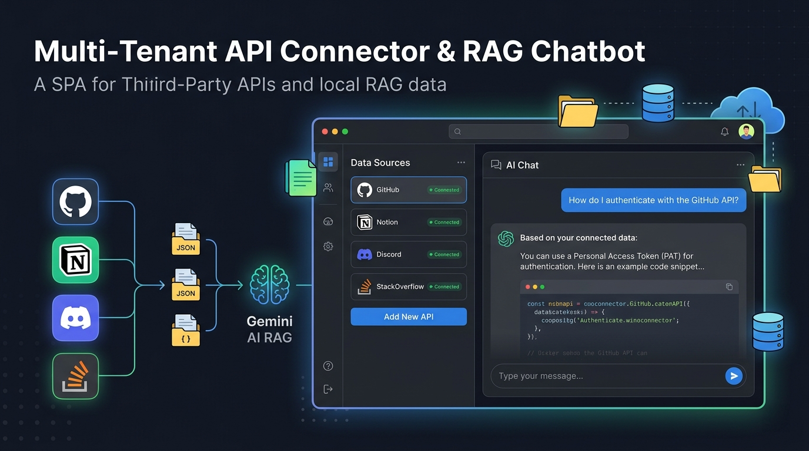

# Multi-Tenant API Connector & RAG Chatbot

An enterprise-grade, developer-first Single Page Application (SPA) designed to unify third-party developer platforms (GitHub, Notion, Discord, Stack Overflow), ingest and chunk documentation and code assets into local vector storage, and query them via an AI chatbot powered by Google's Gemini API (`gemini-1.5-flash`).



[](https://opensource.org/licenses/MIT)
[](https://fastapi.tiangolo.com/)
[](https://react.dev/)
[](https://tailwindcss.com/)
[](https://ai.google.dev/)

---

## Table of Contents

- [Core Features](#core-features)
- [Architecture & Data Pipeline](#architecture--data-pipeline)
  - [Ingestion Pipeline](#ingestion-pipeline)
  - [Retrieval Query Flow](#retrieval-query-flow)
- [System Requirements](#system-requirements)
- [Project Directory Structure](#project-directory-structure)
- [Installation & Setup](#installation--setup)
  - [1. Backend Setup](#1-backend-setup)
  - [2. Frontend Setup](#2-frontend-setup)
- [Seeding Demo Data](#seeding-demo-data)
- [AI Grounding & Prompt Engineering](#ai-grounding--prompt-engineering)
- [Data Connectors & Scrapers](#data-connectors--scrapers)
- [Security & Credentials Redaction](#security--credentials-redaction)
- [GitHub Webhooks Integration](#github-webhooks-integration)
- [API Reference](#api-reference)
- [Troubleshooting](#troubleshooting)
- [Future Enhancements](#future-enhancements)
- [License](#license)

---

## Core Features

- **Multi-Tenant API Ingestion**: Seamlessly integrate data from multiple API platforms (GitHub repositories, Stack Overflow tags, Notion workspaces, and Discord servers) into separate tenant-scoped logical contexts.
- **Dual-Mode Vector Engine**: 
  - **JSON Storage (Default)**: Out-of-the-box local vector calculations (using cosine similarity on memory arrays) stored in a readable JSON file. Zero database configuration or binary dependencies needed.
  - **ChromaDB Storage**: Scalable, high-performance local vector database persistence layer (`VECTOR_STORE=chromadb`).
- **Context-Bound AI Chat**: Conversations are strictly grounded in your connected workspaces using Gemini embeddings (`text-embedding-004`) and chat completion (`gemini-1.5-flash`). The model ignores outside training biases and returns a confidence score alongside platform citations.
- **Incremental Sync & Webhooks**: Instantly trigger code re-indexing via a custom GitHub push event webhook, keeping the chatbot's knowledge fresh in real time.
- **Multi-Layer Credentials Guard**: Automatic scraping denylists that filter files like `.env`, `credentials.json`, `.pem` keys, and sensitive folders during indexing, backed by strict prompt safety rules.
- **Premium ChatGPT-Style UI**: Elegant, responsive dark-themed Single Page Application designed with Tailwind CSS, Lucide Icons, modular configuration panels, and smooth overlay sheets.

---

## Architecture & Data Pipeline

The application features a non-blocking architecture. All scrape-and-embed operations run as independent backend background tasks, allowing users to continue chatting without interface lag.

### Ingestion Pipeline

```
                [ Frontend UI / Add API ]
                           │
                           ▼
                [ POST /api/add-api ]
                           │
             ┌─────────────┴─────────────┐
             ▼                           ▼
      (Write Metadata)           (BackgroundTasks)
      server/data/data.json       process_and_vectorize()
                                         │
                                         ▼
                                  LangChain Loader
                                         │
                                         ▼
                             RecursiveTextSplitter
                           (chunk: 600, overlap: 60)
                                         │
                                         ▼
                             GoogleGeminiEmbeddings
                           (models/text-embedding-004)
                                         │
                                         ▼
                            [ Vector Store Engine ]
                      (ChromaDB Collection / JSON Fallback)
```

### Retrieval Query Flow

```
                  [ Frontend User Chat Msg ]
                              │
                              ▼
                      [ POST /api/chat ]
                              │
                              ▼
                     Generate Embedding
                (models/text-embedding-004)
                              │
                              ▼
                     Similarity Query
                   (Retrieve Top 3 Chunks)
                              │
                              ▼
                    Build Context Blocks
                              │
                              ▼
                      Gemini API Call
                    (gemini-1.5-flash)
                              │
                              ▼
                      Grounded Answer
                  (with source + confidence)
```

---

## System Requirements

- **Operating System**: Windows 10/11, macOS, or Linux.
- **Node.js**: Version 18.0.0 or higher.
- **Python**: Version 3.11 or 3.12 (highly recommended for ChromaDB compatibility).
- **Compiler (For ChromaDB Mode)**: Microsoft Visual C++ Build Tools (C++ workload) is required on Windows platforms for compiling native extensions.

---

## Project Directory Structure

Below is an overview of the key components making up the codebase:

```text
multi_tenate/
├── client/                     # React Frontend (Vite & Tailwind CSS)
│   ├── src/
│   │   ├── components/
│   │   │   ├── ApiDropdown.jsx # Source filter selection panel
│   │   │   ├── DocsOverlay.jsx # Full-page interactive reference sheet
│   │   │   └── LoginModal.jsx  # Mock authentication controller
│   │   ├── App.jsx             # SPA entry, states, and event listeners
│   │   ├── index.css           # Styling directives and custom colors
│   │   └── main.jsx            # DOM mounting entrypoint
│   └── package.json            # Node project configuration
├── server/                     # FastAPI Backend (Python)
│   ├── data/                   # Local database files
│   │   ├── data.json           # User connection list metadata
│   │   └── content.json        # Plaintext chunk storage fallback
│   ├── main.py                 # Core routing, backgrounds, & server run
│   ├── prompts.py              # LLM system directives and formatting
│   ├── scrapers.py             # GitHub README and Stack Overflow scrapers
│   ├── seed_demo.py            # Local crawler to seed vector indices
│   ├── vector_store.py         # Cosine JSON engine & Chroma client
│   ├── requirements.txt        # Python dependency manifest
│   └── .env                    # System keys and vector configuration
├── agent.md                    # System rules for development agents
├── todo.md                     # Roadmap and architectural reference
└── README.md                   # Project documentation (this file)
```

---

## Installation & Setup

Follow these steps to run the application locally on your machine.

### 1. Backend Setup

1. Open a terminal and navigate to the server folder:
   ```bash
   cd server
   ```
2. Create and activate a Python virtual environment:
   - **Windows (PowerShell)**:
     ```powershell
     python -m venv venv
     .\venv\Scripts\activate
     ```
   - **macOS/Linux**:
     ```bash
     python3 -m venv venv
     source venv/bin/activate
     ```
3. Install the dependencies listed in `requirements.txt`:
   ```bash
   pip install -r requirements.txt
   ```
4. Define your environment variables. Create a `.env` file in the `server/` directory:
   ```env
   GEMINI_API_KEY=your_actual_google_gemini_api_key_here
   VECTOR_STORE=json
   ```
   > [!IMPORTANT]
   > Make sure to replace `your_actual_google_gemini_api_key_here` with a valid Gemini API key from [Google AI Studio](https://aistudio.google.com/apikey).

5. Start the backend FastAPI server:
   ```bash
   python main.py
   ```
   The backend server will run at `http://localhost:8000`. You can confirm its health by visiting `http://localhost:8000/`.

### 2. Frontend Setup

1. Open a separate terminal window and navigate to the frontend client directory:
   ```bash
   cd client
   ```
2. Install npm packages:
   ```bash
   npm install
   ```
3. Boot the Vite development server:
   ```bash
   npm run dev
   ```
   The frontend application will start at `http://localhost:5173`. Open it in your web browser.

---

## Seeding Demo Data

The server includes a utility script called [seed_demo.py](file:///e:/Visual Studio Code/Projects/Capstone Project/multi_tenate/server/seed_demo.py) that fetches live documentation from GitHub (React, FastAPI, Vite, and ChromaDB READMEs) and real Stack Overflow queries (python and fastapi tags) using their respective public APIs, chunks the data, generates Gemini embeddings, and seeds the vector index.

To run the seed script:
1. Ensure your backend virtual environment is active.
2. Run the script:
   ```bash
   cd server
   python seed_demo.py
   ```
3. Once completed, your database will contain 6 configured connections, and the generated RAG vector chunks will be available for instant chatting in the UI.

---

## AI Grounding & Prompt Engineering

The system prompt template inside [prompts.py](file:///e:/Visual Studio Code/Projects/Capstone Project/multi_tenate/server/prompts.py) defines the LLM rules to guarantee factual answers and prevent hallucination:

- **Factual Grounding**: The model is strictly instructed to answer questions based *only* on the provided context blocks.
- **Absence Catch**: If the answer cannot be found in the retrieved documents, the chatbot replies with exactly:  
  `"Information not found in your connected application workspaces."`  
  It will not use its own pre-trained weights to guess answers.
- **Explicit Inline Citations**: Claims must be cited with bold tags referring to the platform source, e.g. `"According to your **GitHub (My-Repo)** data..."`.
- **Model Parameters**:
  - LLM: `gemini-1.5-flash`
  - Temperature: `0.1` (ensures near-deterministic, factual outputs)
  - Context limit: retrieves and formats the top `3` most relevant text chunks

---

## Data Connectors & Scrapers

Data extraction functions are modularized in [scrapers.py](file:///e:/Visual Studio Code/Projects/Capstone Project/multi_tenate/server/scrapers.py):

| Platform | Endpoint/API Used | Extracted Data | Status |
|---|---|---|---|
| **GitHub** | `GET /repos/{owner}/{repo}/readme` | Raw project README file | **Live** |
| **Stack Overflow** | `GET /questions (tagged={tag})` | Title, score, views, question body, top-voted answers | **Live** |
| **Notion** | Block API (Recursive block retrieval) | Reconstructs workspace block paragraphs into plaintext | **Stubbed (Limited)** |
| **Discord** | Message History API | Channel conversation text streams | **Stubbed (Limited)** |

---

## Security & Credentials Redaction

To prevent sensitive API keys, passwords, and private configurations from being read by the model, the project implements a three-layer pipeline guard:

1. **Crawler Block List**: [scrapers.py](file:///e:/Visual Studio Code/Projects/Capstone Project/multi_tenate/server/scrapers.py) skips directories and files matching `BLOCKED_PATH_SEGMENTS` at crawl-time:
   ```python
   BLOCKED_PATH_SEGMENTS = {
       ".env", ".env.local", ".env.production",
       "credentials.json", "secrets/", "*.pem"
   }
   ```
2. **Pre-chunk Filter**: The ingestion router inside [main.py](file:///e:/Visual Studio Code/Projects/Capstone Project/multi_tenate/server/main.py) sanitizes raw inputs before compiling them into LangChain Document blocks.
3. **LLM Safety Guardrails**: System instructions inside [prompts.py](file:///e:/Visual Studio Code/Projects/Capstone Project/multi_tenate/server/prompts.py) forbid the model from ever outputting keys or credentials, even if they appear in context.

---

## GitHub Webhooks Integration

This application supports automatic document re-ingestion whenever a push is made to a registered repository.

1. Locate the repository you added in the dashboard.
2. In GitHub, go to **Settings** -> **Webhooks** -> **Add webhook**.
3. Configure the webhook:
   - **Payload URL**: `http://<your-public-host-or-domain>/api/webhooks/github` (Note: for local testing, expose port 8000 using a tunnel utility like **ngrok**: `ngrok http 8000`).
   - **Content type**: `application/json`
   - **Secret**: None
   - **Trigger events**: Push events
4. When a new commit is pushed, GitHub will POST details to the endpoint. The server matches the incoming repository URL against registered displayName/targetUrl connections in `data.json` and automatically kicks off a background sync.

---

## API Reference

The FastAPI server exposes the following endpoints (interactive OpenAPI documentation can be accessed locally at `http://localhost:8000/docs`):

### `GET /`
- **Description**: Returns the server state, configured vector engine, and API status.
- **Response**:
  ```json
  {
    "message": "Multi-Tenant API Connector Server",
    "status": "running",
    "gemini_configured": true,
    "collection": "tenant_knowledge",
    "vector_backend": "json"
  }
  ```

### `GET /api/links`
- **Description**: Returns a list of all active database API connections from `data.json`.

### `POST /api/add-api`
- **Description**: Creates a new tenant source connection or updates an existing one, then launches a background ingestion thread.
- **Request Body**:
  ```json
  {
    "platform": "github",
    "apiKey": "ghp_yourtokenhere",
    "displayName": "Vite-Docs",
    "targetUrl": "https://github.com/vitejs/vite"
  }
  ```
- **Response**:
  ```json
  {
    "status": "success",
    "message": "Queued ingestion for github: Vite-Docs"
  }
  ```

### `POST /api/chat`
- **Description**: Submits a prompt to search the index and query the chatbot. Optional `sources` parameters constrain retrieval scope.
- **Request Body**:
  ```json
  {
    "message": "How do I configure Vite plugins?",
    "sources": ["Vite-Docs"]
  }
  ```
- **Response**:
  ```json
  {
    "answer": "According to your **GitHub (Vite-Docs)** data, you configure plugins in...",
    "source_used": "Vite-Docs",
    "confidence_score": 0.85
  }
  ```

### `POST /api/webhooks/github`
- **Description**: Catches push event hooks from GitHub to prompt incremental updates.

### `DELETE /api/link/{index}`
- **Description**: Removes an integration from the database registry using its index location.

### `GET /api/content`
- **Description**: Dumps all raw text chunks stored in the system index.

### `POST /api/login`
- **Description**: Authenticates a user and overrides the default username badge.

---

## Troubleshooting

### FastAPI server won't start: "GEMINI_API_KEY is missing"
You must specify your Gemini API key in `server/.env`. Make sure you don't have spaces around the equals sign, and restart the backend.

### Frontend interface remains stuck loading "Free Plan"
Click the profile icon in the bottom left of the sidebar, type in an email inside the **Login Modal**, and press **Login** to authorize the session. The user context will update and display your username badge.

### ChromaDB installation fails on Windows
ChromaDB requires a C++ compilation toolchain to compile binary components during installation. Ensure you have installed Microsoft Visual C++ Build Tools (Desktop development with C++ workload selected) and are using Python 3.11 or 3.12. If build issues persist, verify that `VECTOR_STORE=json` is set in your `.env` file to fall back to the memory-efficient JSON vector store.

### API Connection added in UI but chat answers show 0% confidence
Ingestion tasks run asynchronously in the background. If you just added a large repository or connection:
- Wait a few seconds for the background task to complete.
- Check the backend console output for any scraping or rate-limit warnings.
- Confirm the data has written to `server/data/content.json` or `server/data/chroma_db/fallback_vectors.json`.

---

## Future Enhancements

- [ ] Complete Notion workspace parsing and block stitching implementation.
- [ ] Implement Discord server message sync loops.
- [ ] Add actual full repository folder indexing to GitHub scraper beyond README crawling.
- [ ] Expose settings panel for custom token count parameters and similarity search thresholds.
- [ ] Persist conversation history to local storage.

---

## License

This project is licensed under the terms of the MIT License.
